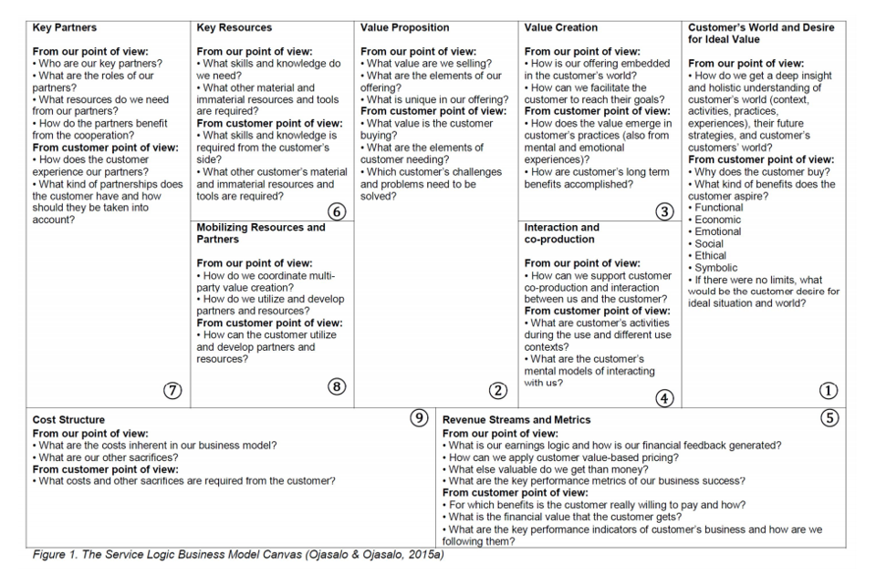
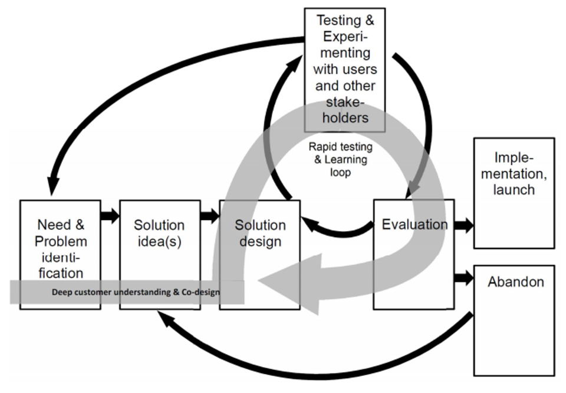

# Week 10

This week is talking about lean process and negotiation exercise.

#### Exam part:

**Tool: **

**Prioritising Leap of Faith Opportunities, **

**Negotiation process, **

**Service logic business model canvas**

**Concept: Lean canvas, Leap‐of‐faith assumptions**

---

## What is Lean Process

The core idea is to maximize **customer value** while minimizing waste. Simply, lean means creating more value for customers with fewer resources.

A lean organization understands customer value and focuses its key processes to continuously increase it. The ultimate goal is to provide perfect value to the customer through a perfect value creation process that has zero waste.

## How are services different to products?

* Products have a 'tangibility' factor 
* much of services are unknown until the service is actually delivered.

## MVP

Minimum viable product = smallest set of features and/or activities needed to test a hypothesis.

## Lean Canvas

When we have got the Lean Canvas at the startup, we know every single box is a guess (Not a random guess).

The Lean Canvas is more actionable and entrepreneur-focused. It deeply focuses on startup factors such as uncertainty and risk. Because it was space constrained.

The really important things are different. But the high level is similar.

Customers are the central of the services.

## Leap‐of‐faith assumptions

Help to test Lean Canvas -> Which testing start first

E.g. Lower impact and long time not happens will not be tested...

---

Discussion Question 1:

Control group, randomly selected, no basis. 

Two groups should as close as to identical.

Discussion Question 2:

Different between services and products.

Discussion Question 3:

The lean startup does not mean cheap, does not mean cut corners, does not mean going ahead without solving basic problems. 

Easy to fail.

Discussion Question 4:

Keeping records is very beneficial.

What can we learn from fact

-----

# Negotiation

* Negotiation is a decision-making process, which is required when we cannot accomplish our objectives on our own.
* Negotiation ability can be improved with practice and reflection.

#### The stage of negotiation

* Prepare (who they are, what they want to get)
* Discuss (~~Put offer on the table~~)
* Propose
* Bargain

Positive Bargaining Zone (PBZ)

Bargain range is in the overlap part.