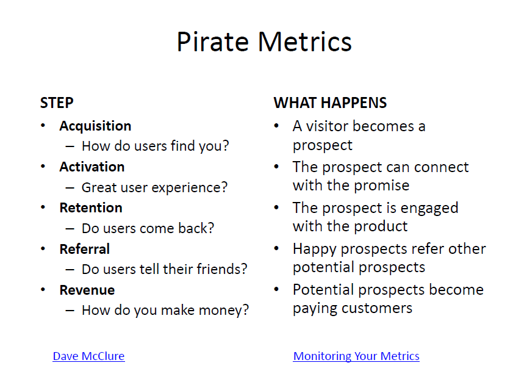
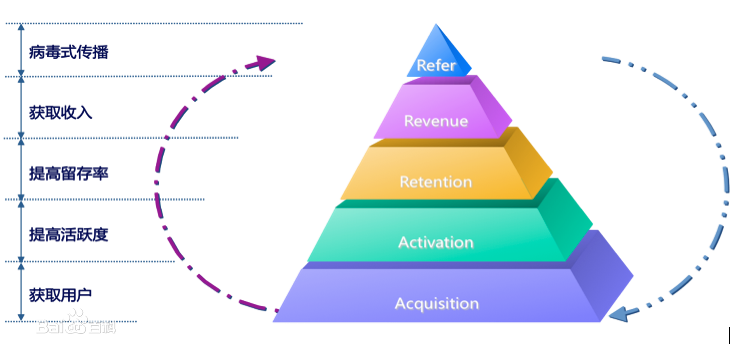

# Week 11

This lecture is talking about...

 

###  Exam part:

**Concept:**

**Pivot**

**MVP**

**Pirate metrics**

---

Business model canvas is good for business is up and running 

Lean Canvas is good for startup business, it tells you that spend more times on problem than on solutions.

  
## customer segmentation

Definition: The grouping together of customers based on similarities they share with respect to any dimensions relevant to your business.

Purpose: Send specific message to specific groups. Even the product does not change -> sell it in different ways.

Dimensions: age, gender, needs, interest

Objectives: creating segmented ads, developing differentiated customer servicing and retention strategies, greatest profits.

  

### Target

1. Buy similar products
2. Similar sales cycle and value proposition
3. Talk to each other

  

## Pirate Metrics

Why it called pirate metrics? -Because it's AARRR!!!
 

**AARRR**

 
 

## AARRR 

Acquisition、Activation、Retention、Revenue、Refer. 这个五个单词的缩写，分别对应这一款移动应用生命周期中的5个重要环节。

**获取用户（Acquisition）**
运营一款移动应用的第一步，毫无疑问是获取用户，也就是大家通常所说的推广。如果没有用户，就谈不上运营。
 

**提高活跃度（Activation）**
如何把他们转化为活跃用户，是运营者面临的第一个问题。好的推广渠道往往是有针对性地圈定了目标人群，他们带来的用户和应用设计时设定的目标人群有很大吻合度，这样的用户通常比较容易成为活跃用户。另一个重要的因素是产品本身是否能在最初使用的几十秒钟内抓住用户。
 

**提高留存率（Retention）**
通常保留一个老客户的成本要远远低于获取一个新客户的成本。解决这个问题首先需要通过日留存率、周留存率、月留存率等指标监控应用的用户流失情况，并采取相应的手段在用户流失之前，激励这些用户继续使用应用。通常来说，工具类应用的首月留存率可能普遍比游戏类的首月留存率要高。
 

**获取收入（Revenue）**
获取收入其实是应用运营最核心的一块。收入有很多种来源，主要的有三种：付费应用、应用内付费、以及广告。无论是以上哪一种，收入都直接或间接来自用户。所以，前面所提的提高活跃度、提高留存率，对获取收入来说，是必需的基础。用户基数大了，收入才有可能上量。
 

**自传播（Refer）**
以前的运营模型到第四个层次就结束了，但是社交网络的兴起，使得运营增加了一个方面，就是基于社交网络的病毒式传播，这已经成为获取用户的一个新途径。这个方式的成本很低，而且效果有可能非常好；唯一的前提是产品自身要足够好，有很好的口碑。
  

## Pivot

When to pivot: 

* Exhausted your pursuit of productmarket fit with your current product or market.
* Pivoting can be expensive, but not pivoting can be even more expensive
 

**How do we know what to change?**

* customers show us: follow the data and the users
* change the customers or change the problem but just one at a time.
* Define measures of success/failure before testing.
* Test, Test.

 
 
 

----

END
