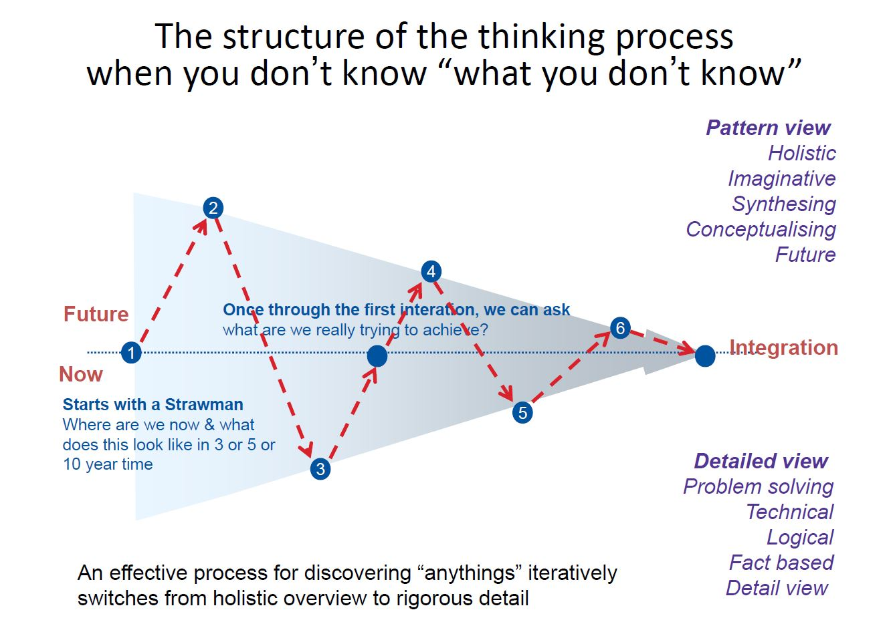
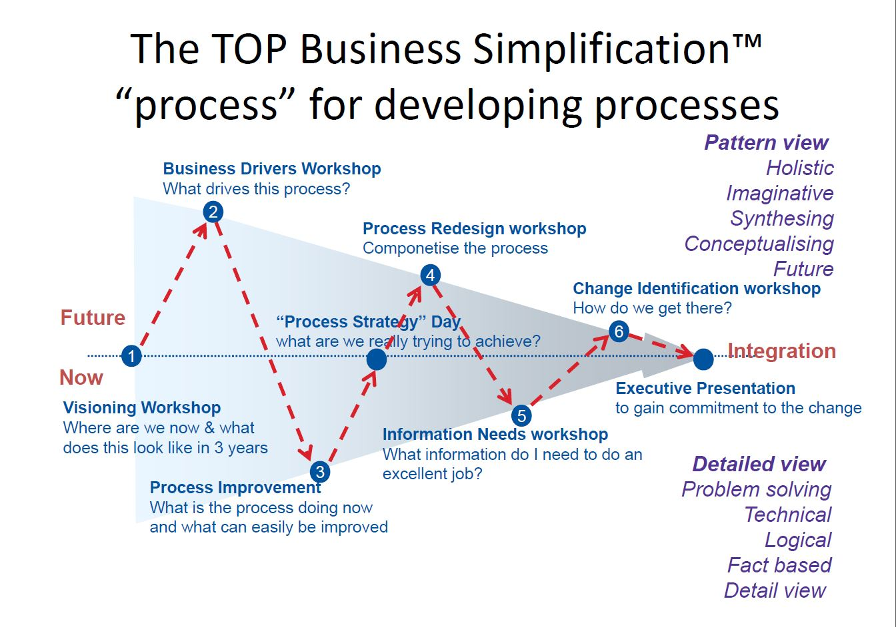

# Week 4

This lecture is talking about how to choose a gift and design thinking.

 

### Exam part

**Tools:**

Design thinking process

**Concept:**

Design thinking

Business simplification

 

## Design thinking

A human centred, creative problem seeking & solving framework that draws on the skills and mindsets of a designer.

* Great tool for if do not understand the problems or solutions.

* Desirability -> people desire?
* Feasibility -> can we overcome technical problems? 
* Viability -> can we earn money?

 

### Different Thinking of business thing and design thing

* Multiple problems to one solution
* get understood and get more problems and get more solutions

### Design Thinking Principles

* Empathy -> put yourself into others situations; trying to understand what other people is experiencing.
* Modelling -> physics, digital model
* Prototyping
* Tolerance for failure
* Restraint

### Design Thinking process

* Empathize -> learn (who is user? what matter they have?)
* Define -> create a view of needs
* Ideate -> Brainstorm (solutions)
* Prototype -> Build representation (how to show ideas)
* Test -> share prototyped
* If test not passes might go back to ideate.

* "What are we really trying to achieve"

* Strat with current process and document them (have lots of missing processes and gaps, have problems...). we can learn what the problems are. First goal: how to improve it?

* Then improve them.

* Know what we are going to achieve and what good processes are then Redesigned.

* Adding understanding and information to the process.

* Get something to start building some technologies system for. And get ideas what we can do in future.

  (Reengineering means do not improve.)

1. What it the key things; what are elements
2. Document the processes, find out issues
3. What actually we trying to do
4. componentise process
5. What information 
6. How to achieve

---

END