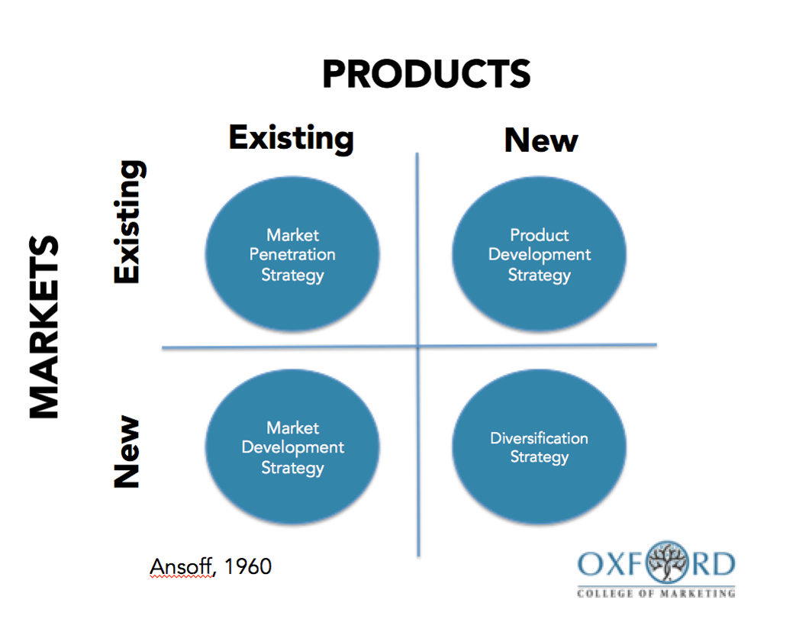

# Week7

This week is talking about products innovation

 

 

### Exam part

**Tools:**

Ansoff matrix

**Concept:**

Product innovation

User innovation

Lead user approach

Path dependency

 

 

## Models of innovation

1. Producer
2. User
3. Open collaborative
4. Trends
   1. Falling communication cost
   2. Falling design cost
   3. Increasing modularity

Risk = probability of failure * consequence

### Business model innovation

 

Ask right question to discover what they want to achieve

##Path dependency 

Every decision you make determines what you CAN and CANNOT do both now and in the future.

### TACIT knowledge 

also called information knowledge ->默契的知识？

Unwritten, unspoken, and hidden vast storehouse of knowledge held by practically every normal human being

### CODIFIED knowledge 

=> explicit knowledge -> 明确的知识？

Articulated
knowledge, expressed and recorded … is easy to communicate, store, share and distribute

### Closed / open paradigm for managing industrial R&D 

outside / inside the organisation

Open: outside -> ideas, people, entire innovation

### Lead User (Super users)

Take ideas for needs and solutions from people at the leading edge of markets (“lead users”) instead of customers at random

get the benefits from a solution -> motivated to innovate

high needs users -> fit needs first

novel ideas

**Collection information form user**

* pyramid of expertise
* workshops

**Organisation concerns**

* Developing incompatible products -> might not be able to make it
* IP -> no IP issue
* Time and effort required -> more expensive

**Learn from 3M**

* LU ideas are more novel than non-LU ideas -> Useless to talk with normal customers
* LU ideas have projected sales 8 times higher than non-LU ideas
* LU ideas fit criteria for new major product lines, non-LU ideas were generally incremental improvements
* No differences in compatibility or IP protection, but LU ideas cost three times more than non-LU ideas

### user communities 

people who interesting in something like open source software...

* Sufficient incentive to innovate: benefits > costs 

  benefits is not financial but motivate user to innovate

* An incentive and the means to voluntarily reveal their inventions: benefits > costs

* User-led diffusion of innovations can compete with commercial production and distribution

### User Innovation

Many users develop or modify products,but only some become manufacturers – opportunity costs matter

User innovators -> user communities-> user manufacturers =>Designs,community, and prototyping

----

END