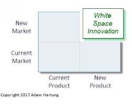

# Week7

This week is talking about products innovation and product development thinking exercise.

 

 

### Exam part

**Tools:**

Ansoff matrix

**Concept:**

Product innovation

User innovation

Lead user approach

Path dependency

 

 

 

**Risk = probability of failure * consequence**

New markets and new products have high probability of failure.

Don't do it by yourself, find somebody to do it for you. there is some innovators, new place which you can take your project outside of your organisation. => Put this new project out, somewhere else. => "I can help you with it!"

 

 

 

##Path dependency 

Ask right question to discover what they want to achieve...

The past decisions can influence future decisions and options. 

Every decision you make determines what you CAN and CANNOT do both now and in the future. 

### TACIT knowledge 

also called information knowledge ->心照不宣的知识？

Unwritten, unspoken, and hidden vast storehouse of knowledge held by practically every normal human being

### CODIFIED knowledge 

=> explicit knowledge -> 明确的知识？

Articulated
knowledge, expressed and recorded … is easy to communicate, store, share and distribute

 

 

### Closed / open paradigm for managing industrial R&D 

* outside in / inside out
* Open: outside -> ideas, people, entire innovation (Lego,)

## Lead User (Super users)

* Two characteristics: High need user, get the benefits at first time when get innovate
* Big idea: talk with the best customers. Take ideas for needs and solutions from people at the leading edge of markets (“lead users”) instead of customers at random
* get the benefits from a solution -> motivated to innovate
* high needs users -> fit needs first
* novel ideas

### Collection information form user

* pyramid of expertise
* workshops

### Organisation concerns

* Developing incompatible products -> might not be able to make it
* IP -> no IP issue
* Time and effort required -> more expensive

### Learn from 3M

* LU ideas are more novel than non-LU ideas -> Useless to talk with normal customers
* LU ideas have projected sales 8 times higher than non-LU ideas
* LU ideas fit criteria for new major product lines, non-LU ideas were generally incremental improvements
* No differences in compatibility or IP protection, but LU ideas cost three times more than non-LU ideas

 

### user communities 

people who interesting in something like open source software...

* Sufficient incentive to innovate: benefits > costs 

  benefits is not financial but motivate user to innovate

* An incentive and the means to voluntarily reveal their inventions: benefits > costs

* User-led diffusion of innovations can compete with commercial production and distribution

### User Innovation

Many users develop or modify products,but only some become manufacturers – **opportunity costs** matter

User innovators -> user communities-> **user manufacturers** =>Designs,community, and prototyping

## Models of innovation

1. Producer
2. User
3. Open collaborative
4. Trends
   - Falling communication cost
   - Falling design cost
   - Increasing modularity

 

----

END