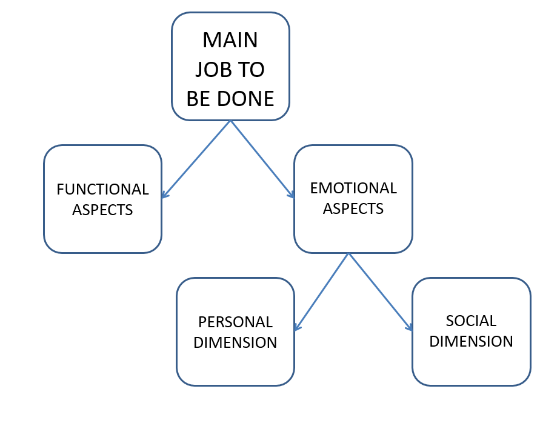

# Week 8

Exam part

Tools: 

Business model canvas

Jobs-to-be-done analysis

Concept:

Business model innovation

## Business Model

## Model

The third kind of innovation(product, process).

Airbnb, uber, container shipping, Xerox

**A business model is a descripation how an organisation creates, delivers and captures economic value.**

### Business Model Canvas

Useful for starting business

connection of innovation and entrepreneurship

=======
### Model canvas

* Key partners
* Key activities
* Key resources
* Value propostions
* Customer Relationships
* Channels
* Customer Segments
* Cost structure
* Revenue Streams

having a picture of the current state of business (model) is very handy. If we change one part of model, we should think about other parts.

This canvas is the links between innovation and entreperneurship.

Popuplar for starting the business.

### Needs for new business model

* meet the needs of largecustomers
* New technology
* bring a new job to be done
* Defendagainst new, low-end competition
* Respondto a shifting basis of competition 

-----

END