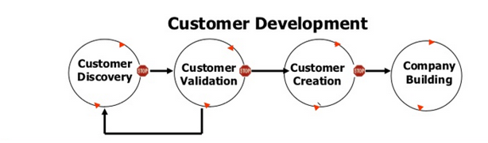

# Week 9

This week is talking about entrepreneurship and business pivote and entrepreneurship  exercise.

 

* new small businesses are copying existing business...

 

* Believed cannot have cost and quality at the same time.
* Henry Ford -> assembly line/ assembly process
* Classic waterfall model -> (requirements analysis, design, implementation, verification, maintenance)
  * hard to get requirement right 
  * situation changes 
  * user/client might have new requirement
  * Agile meets better

## Lean Startup Model

go out, open mind, 

to talk with customers

**Customer Development**

* Hypotheses
* Experiments
* Insights
* Incremental, quick, minimum features
* Customer and revenue validation

**Product Development**

* Data
* Feedback
* Insights
* Extremely rapid deployment
* Just-in-time architecture and infrastructure

pivote

changes to add more component in business model.

