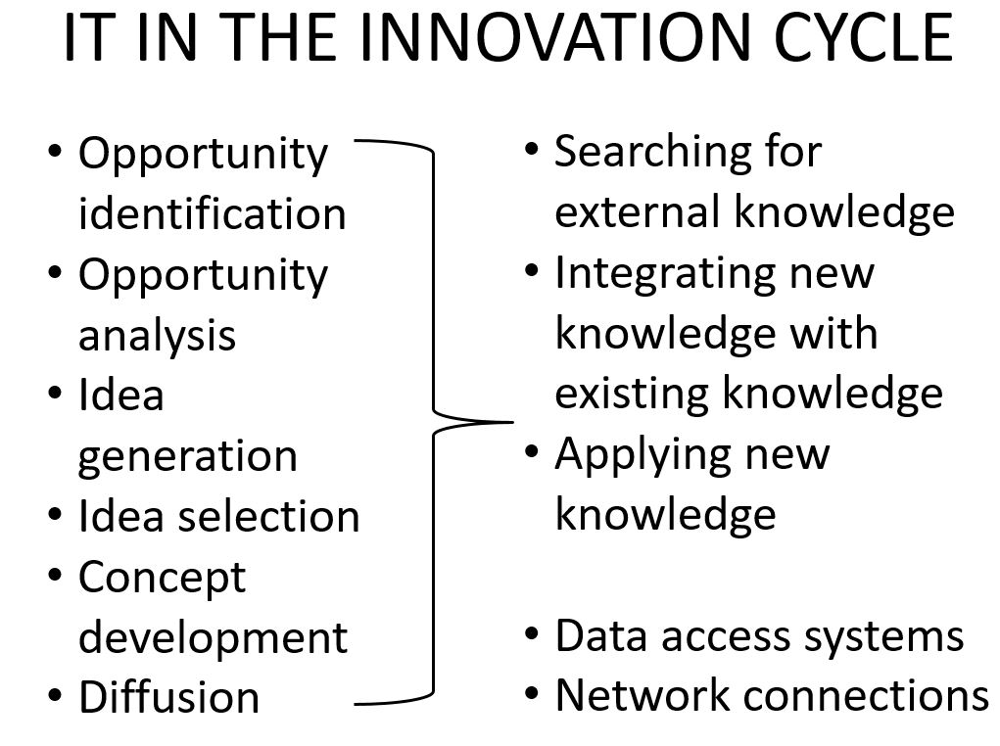

# Week 1


### **Exam part:**

**Concept:**

Innovation

Innovation cycle

Innovators vs Adaptors

Business processes

Process innovation

Product innovation

Business model innovation

Business model

<br />

---

<br />


How innovation applied in IT?

How can innovation help business success?

* Business success?
* Entrepreneurial mindset.

 <br>  <br> 
# What is innovation? 
* **valuable and novelty**
* **Innovation cycle**: Think -> act-> check -> learn -> think
* The first criterion for innovation is the market.


### Adaptor vs Innovators

Some people are more innovate, some are more adapts.

When come to a problem

```
| Facet         | Adaptors           | Innovators  |
| ------------- |:-------------:| ---------:|
| Originality   | Few solutions, most can be implemented | Many solutions, most of are impractical |
| Efficiency    | Clear about goal, process step by step| No detail. May do not know the goal|
| Governace     |Socially acceptable|Ignore the rules|	
```

* Not good for a company with all innovators, and easy to fail. 
* Adaptors and innovators no better. Depends on the situation.
* Adaptors are keeps business running. They satisfies the customers and bring the money.
* Innovators few. Think about what is the product after that. Worries about future.


<br>  

### Digital Innovation
* Valuable Novelty that is embodied in, or enabled by, Information Technology.
* Comes in three flavours: process, product, and business model.

Different with others innovation:

Transforming information by digital or analogue;

Moore's law: faster, quicker and cheaper

Network effects

<br />

<br />

#### Digital Process Innovation
* **New ways of doing things** in an organisational setting that are embodied or enabled by IT

* Components, assemblies, and assemblies of assemblies

* Typically focus on **technology adopters**
  <br>

  <br> 

  <br> 

  ?

  


#### Digital Product Innovation

* New **products or services** that embodied in IT or enabled by IT. 

* Platforms, consumer products, and enhanced services

* Typically focus on **technology producers**
  <br> 

  <br>


#### Digital Business Model Innovation
* “Business model”= **description of how an organisation creates, delivers, and captures value** -> what they do, can we change it?
* A new way of creating, delivering, and capturing value that is embodied in or enabled by IT
* Typically focus on **technology producers** �C often accompanied by product innovation


 <br>  <br> 

 <br>  

<br>

 <br>  

<br>  


---

cut-off line, I don't know what is going on for following notes....

<br />

<br />


## The difference between innovation and creativity -> 创新与创造的不同
* Creativity is a production of something original.
* Innovation requires creativity and Experimentation, observation, analysis and guessing.

 <br>  <br> 
***

### The first criterion for being a great innovation is that there is a market for it.
* Target segment?
* customer's needs/ want it/ buy it?

 <br> 

### The second criterion for being a great innovation is that it actually works.
* Will it work?
* Clear concept?
  Final product satisfy the market?

***
<br>

## Distinctive Characteristics of Information Technologies
* Digitalisation: primarily or entirely digital
* Moore’s Law: Change/improves quickly
* Network effects: Digital innovations more valuable
  <br> 

***

<br> 

## Whether, When, and How to Innovate with IT
Mindful: attending to an innovation with reasoning grounded in an organisation’s own facts and circumstances, examining the claims for the benefits of an innovation in light of the organisation’s particular situation.
<br> 

->根据自身组织的情况来进行创新和研究。
<br> 

* Mindless:  being content with “everyone is doing it” as a rationale for adoption, and accepting innovations promoted by consultants and by CEOs who encounter fashionable ideas.
* Goal: be a prudent and discerning innovator 


<br>

<br>

<br>

<br>

<br>

<br>

The first criterion for being a greatinnovation is that there is a market for it


Innovation is not always good. -> guns

Innovation can help business value increase unstable, there might have a leap.


***
END
