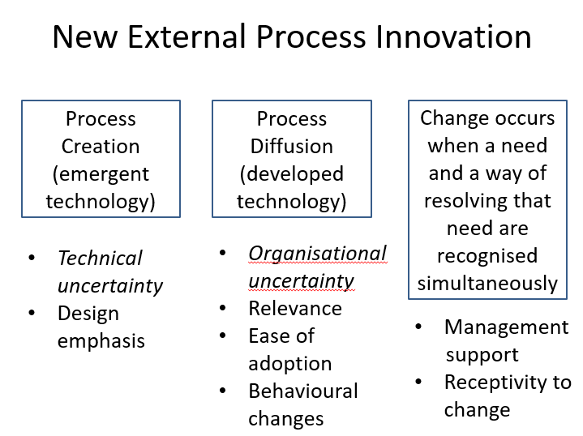

# Week 2

This week is talking about business process innovation and process map exercise.

 

 

#### Exam part:

**Tools:**

Processing map

**Concept:**

Business processes

Process innovation

Diffusion of innovation 

Reengineering

Hype cycle

 

 

### What is business process

“**a structured, measured set of activities designed to produce a specific output for a particular customer or market.** It implies a strong emphasis on how work is done within an organization, in contrast to a product focus’s emphasis on what. A process is thus a specific **ordering of work activities** across time and space, with a beginning and an end, and clearly **defined inputs and outputs**: a structure for action. Processes are the structure by which an organisation does what is necessary to produce value for its customers.” 
 

During design the process, we need to think:
* What could possibly go wrong?

 

**Process Innovation:** 

Improving the way you do the business/New technology. - Have more frequency and less degree of change. ->assembly line

**Business model innovation:** 

Launching a new business. - Have lower frequency and more degree of change.

**Product/services innovation:** 

Commercial products and new offerings for customers. - frequency and degree of change in the middle.
 

### Make process better

Auto, prefill, make system stable, 

### why process chart is import?
under control, in IT need be clear flow between computer and human in process. 

 

 

Overtime, the mix innovation shifts. Form product innovation at the beginning and process innovation later on.

When turn to services, it inverse. Process innovation at the beginning, latter product innovation.

**Dominant design** can rise up product innovation and reduce process innovation.  
-> Do to innovation together is risky. 
-> If a dominant design happens, product/process innovation will rise, another will go down.

 
 

 

## Diffusion of innovation 

 

### Reengineering

-> If you get a process don't perform, don't try to fix it. Throw out and start out a new one.   
-> 业务流程重组    
-> very popular at the beginning.  -> 75% largest companies in the USA use it.

->not use it anymore.  

**Why do we not use it?**

If you get a process don't perform, don't try to fix it. Throw out and start out a new one.  

- many companies cannot offer it. 
- The world change quickly.(IT services) 
- Soon became synonymous with staff cuts, outsourcing, and off-shoring. 
- IT support new processes took a long time to create. 
- many failures  

 

If in the internal process innovation: -> not consider about external things
Current performance: Time, Quality, Cost, Flexibility—>the availability of changing input/output (可以接受新的output的程度)
, etc.
Improvement practices: Resequencing, Set-up time reduction, JIT supplies, “Informating” ->  It is the process that translates descriptions and measurements of activities, events and objects into information. By doing so, these activities become visible to the organization.  
->when producing a product, it will also produce the information about themselves. (translating information into action also register data about those automated activities) 

### New External Process Innovation

##### Existing External Process Innovation:

1. Process innovation Candidates
2. Improvement Process
3. Changes in Process Performance

##### New External Process Innovation

1. Process Creation (emergent technology) -> technical uncertainty
2. Process Diffusion (developed technology)
3. Change occurs when a need and a way of resolving that need are recognised simultaneously.

 

#### Diffusion/Accepts

Diffusion means spread.

*  "S" shape

*  Not all get 100%

*  The more people involved in the decision, the slower the diffusion

*  Social system – norms, innovation capacity, perceived needs or gaps 

##### Adoption Level

Tipping point 

Infamous Chasm -> fail

 

 

(Hype cycle in at next week notes)

---

END